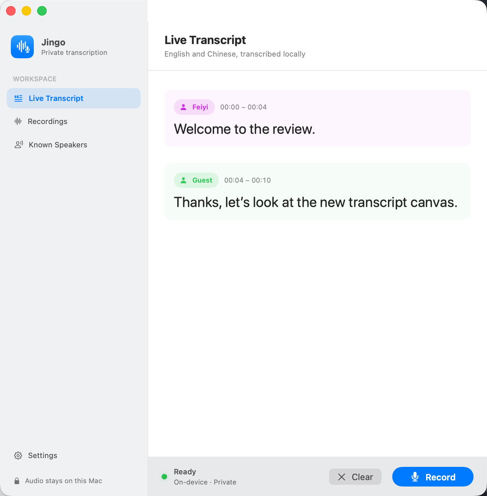

<div align="center">
  <a href="https://github.com/fwang2/Jingo">
    
  </a>

  <h1>Jingo</h1>

  <p><strong>Private, on-device bilingual transcription for Mac, iPhone, and iPad.</strong></p>
  <p>Jingo turns English, Chinese, and code-switched conversations into readable transcripts with speaker attribution—without uploading recordings to a transcription service.</p>
</div>

<p align="center">
  
  
  
  
  
</p>

<p align="center">
  
</p>

## What Jingo Does

- Transcribes English, Chinese, and mixed-language speech locally with Qwen3-ASR.
- Separates conversations into timestamped speaker turns with FluidAudio diarization.
- Refines speaker attribution periodically during longer Mac recordings and performs a final full-recording pass when recording stops.
- Learns known speakers from conversations or dedicated voice samples, then recognizes them in later recordings.
- Creates structured meeting summaries locally on Mac, including findings, decisions, unresolved items, participant contributions, actions, risks, and meeting status.
- Keeps recordings, transcripts, voice profiles, and model inference on the device.
- Provides a native Mac workspace alongside the iPhone and iPad experience.

Speaker diarization and speaker identification are different stages: diarization determines *who spoke when* within a recording, while a saved voice profile gives that speaker a persistent name across recordings.

## Two Device-Appropriate Pipelines

Jingo does not make the mobile app pay the memory cost of the desktop pipeline, or limit the Mac to mobile-scale processing.

| Platform | Transcription | Speaker processing | Meeting summaries |
| --- | --- | --- | --- |
| Mac | Qwen3-ASR 1.7B, 4-bit | High-performance pipeline with concurrent processing, adaptive checkpoints, and final refinement | Qwen3 4B Instruct, 4-bit |
| iPhone and iPad | Qwen3-ASR 0.6B, 4-bit | Resource-constrained sequential pipeline that unloads large auxiliary models between stages | Not currently available |

Both paths use Qwen forced alignment to place words on the timeline and FluidAudio to perform speaker diarization.

## Privacy and Model Downloads

Audio and transcripts stay on the device. Jingo downloads its open models the first time they are prepared; after that, transcription and speaker processing run locally. The first run therefore requires internet access and takes longer than subsequent launches.

Known-speaker voice samples are stored locally. A sample needs at least six seconds of clear, single-speaker speech; recording 10–15 seconds is recommended.

## Local Meeting Summaries on Mac

Jingo can automatically summarize a recording after transcription finishes or create a summary later from the recording card. The separate Qwen3 4B Instruct model runs through MLX on Apple silicon and can be downloaded from **Settings → Meeting Summaries**.

Summary detail scales with the recording duration and transcript density. Brief recordings receive a correspondingly short result, while substantive meetings can include:

- key findings and confirmed decisions;
- unresolved, deferred, or rejected items;
- important participant contributions;
- explicitly assigned action items;
- material risks and follow-up questions;
- source-linked highlights and an overall meeting-status assessment.

The default summary prompt is editable Markdown. Settings provides separate **Edit** and **Preview** tabs, plus an option to restore the bundled default. Factual grounding, the structured result, and adaptive length limits remain enforced even when the prompt is customized.

Summary content and prompt settings remain local. The **Account** page is reserved for a future iCloud backup feature for settings and recordings; it does not currently upload or synchronize data.

## Build and Run

### Requirements

- Apple silicon Mac
- macOS 14 or later
- Xcode 27 with the iOS 27 simulator runtime
- `make` and `curl`

The repository pins Tuist, SwiftLint, and SwiftFormat through `mise`; the setup command installs the declared versions.

```sh
git clone git@github.com:fwang2/Jingo.git
cd Jingo
make
open Jingo.xcworkspace
```

Open the generated `Jingo.xcworkspace`, not the `.xcodeproj`.

### Run the Mac app

1. Select the `JingoMac` scheme.
2. Choose **My Mac** as the destination.
3. Press **Run**.
4. In Jingo, prepare the model and grant microphone access when macOS asks.

### Run on iPhone or iPad

1. Connect a physical device and select the `JingoDev` scheme.
2. Choose the device as the destination.
3. Press **Run** and grant microphone access.

The simulator is useful for interface and unit tests, but Qwen and FluidAudio integration inference requires a physical Apple device.

## Testing

The project includes model-independent unit tests, speaker attribution and execution-policy tests, physical-device inference tests, iOS snapshots, and Mac UI tests.

For the Mac app:

```sh
xcodebuild -workspace Jingo.xcworkspace \
  -scheme JingoMac \
  -destination 'platform=macOS' \
  CODE_SIGNING_ALLOWED=NO build

xcodebuild -workspace Jingo.xcworkspace \
  -scheme JingoMacUITests \
  -destination 'platform=macOS' test
```

The iOS test schemes can be run from Xcode with an iOS simulator. Tests that exercise MLX and FluidAudio inference are intentionally skipped unless they run on a compatible physical device.

## Toolchain

| Component | Version |
| --- | --- |
| Xcode | 27.0 |
| Swift compiler | 6.4 |
| Project Swift language mode | 5.10 |
| Minimum macOS deployment | 14.0 |
| Minimum iOS deployment | 18.0 |
| Tuist | 4.208.0 |
| SwiftLint | 0.65.1 |
| SwiftFormat | 0.63.0 |

## Project Lineage and Direction

Jingo began as a fork of [Saik0s/Whisperboard](https://github.com/Saik0s/Whisperboard), whose original work remains an important inspiration and foundation.

By version 0.2, little implementation lineage remains in the core transcription experience. Jingo now has its own Qwen-based ASR stack, FluidAudio speaker pipeline, device-specific execution policies, native Mac app, transcript interface, and known-speaker system. It is independently maintained and is not intended to track or merge back into Whisperboard.

Future development follows Jingo's own roadmap, prioritizing transcription quality, speaker identity, long-session reliability, and a coherent private workflow across desktop and mobile. Original authorship and license attribution remain preserved.

## License and Acknowledgements

Jingo is licensed under GPL-3.0. The bundled Poppins and Karla fonts are licensed under the SIL Open Font License.

Core projects and prior work:

- [Whisperboard](https://github.com/Saik0s/Whisperboard)
- [Qwen3-ASR](https://github.com/QwenLM/Qwen3-ASR)
- [FluidAudio](https://github.com/FluidInference/FluidAudio)
- [MLX Swift](https://github.com/ml-explore/mlx-swift)
- [The Composable Architecture](https://github.com/pointfreeco/swift-composable-architecture)
